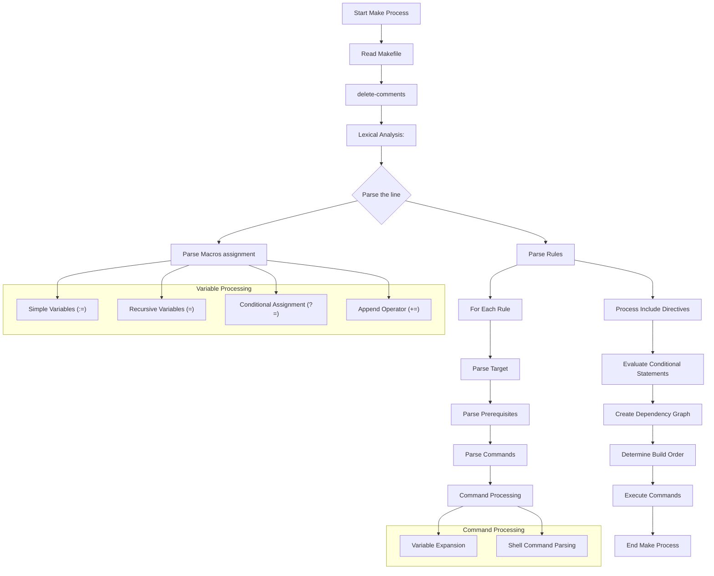

Here's a detailed flowchart showing how Make parses a Makefile:



This diagram shows the main steps in Makefile parsing:

1. Initial reading of the Makefile
2. Lexical analysis of the content
3. Processing of variables and their different types
4. Parsing of rules (targets, prerequisites, and commands)
5. Handling of include directives and conditionals
6. Creation of the dependency graph
7. Execution of commands in the correct order

<aside> 

MACROS assginment may expand to an entire rule if the rule is build on one line only because MACROS can re-split after it has expanded them. Otherwise it cannot.

```makefile
myrule = target : ; echo built
$(myrule)
```

</aside>