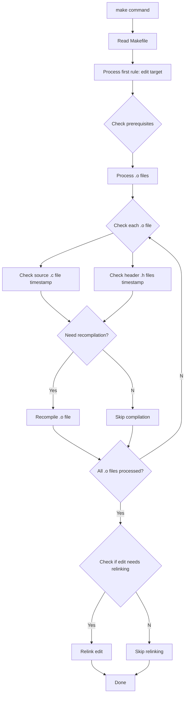

```makefile
target ...: prerequesites ...
	recipe
	...
	...
	...
```

## Understanding Makefile Components

### Targets

A target is the file or task that needs to be created or executed. It's typically the output of the build process. This could be an executable file, object file, or just a label for a set of commands (phony target).

```makefile
program: # This is a target
clean:   # This is another target
```

### Prerequisites

Prerequisites (or dependencies) are files that are needed to create the target. Make uses these to determine if the target needs to be rebuilt. If any prerequisite is newer than the target, the target will be rebuilt.

```makefile
program: main.o utils.o  # main.o and utils.o are prerequisites
	gcc -o program main.o utils.o
```

### Recipes

Recipes are the commands that make executes to build a target. These are the actual shell commands that perform the compilation, linking, or any other required actions. Each recipe line must begin with a tab character.

```makefile
main.o: main.c
	gcc -c main.c    # This is a recipe
	
clean:
	rm *.o          # This is also a recipe
	rm program
```

### Complete Example

```makefile
# Target: program
# Prerequisites: main.o and utils.o
# Recipe: gcc command to link objects
program: main.o utils.o
	gcc -o program main.o utils.o

main.o: main.c
	gcc -c main.c

utils.o: utils.c
	gcc -c utils.c

clean:
	rm *.o
	rm program
```

<aside> 

if we prefer to change the prefix to put another for example :

```makefile
.RECIPREFIX = >
all:
> @echo Hello, world!
```

</aside>

## Here the first simple makefile that we will improve

```makefile
edit : main.o kbd.o command.o display.o \\
       insert.o search.o files.o utils.o
        cc -o edit main.o kbd.o command.o display.o \\
                   insert.o search.o files.o utils.o

main.o : main.c defs.h
        cc -c main.c
kbd.o : kbd.c defs.h command.h
        cc -c kbd.c
command.o : command.c defs.h command.h
        cc -c command.c
display.o : display.c defs.h buffer.h
        cc -c display.c
insert.o : insert.c defs.h buffer.h
        cc -c insert.c
search.o : search.c defs.h buffer.h
        cc -c search.c
files.o : files.c defs.h buffer.h command.h
        cc -c files.c
utils.o : utils.c defs.h
        cc -c utils.c
clean :
        rm edit main.o kbd.o command.o display.o \\
           insert.o search.o files.o utils.o
```

<aside> 

important rules here :

- When a target is a file : it needs to be recompiled if any of its prerequisites change. All the automatic generated prerequisite should be updated first.
- what make does is execute the recipe once the condition are gathered within the prerequisites
- when the target is not a file, it’s an action that cam be called to perform differents actions in the architecture of the application. They are called `phony targets`

</aside>

## How make process a Makefile

The `default goal` : goal are targets that make strives ultimately to update. They’re also the first target to appear in the reading of makefile

Thus when we give the command `make` to the prompt the folllowing happen:



## First simplification by referencing the variable

```makefile
objects = main.o kbd.o command.o display.o \\
          insert.o search.o files.o utils.o

edit : $(objects)
        cc -o edit $(objects)
main.o : main.c defs.h
        cc -c main.c
kbd.o : kbd.c defs.h command.h
        cc -c kbd.c
command.o : command.c defs.h command.h
        cc -c command.c
display.o : display.c defs.h buffer.h
        cc -c display.c
insert.o : insert.c defs.h buffer.h
        cc -c insert.c
search.o : search.c defs.h buffer.h
        cc -c search.c
files.o : files.c defs.h buffer.h command.h
        cc -c files.c
utils.o : utils.c defs.h
        cc -c utils.c
clean :
        rm edit $(objects)
```

resolve a limitation of the first solution which is to duplicate the list in and potentially might forget to update the dup element if modification. It tends to be `error-prone` . Thus a good way would be to simply wrap up all the lists of this element in an object variable. But there’s stilll some redundancy

### We can let make Deduce The Recipes

it has an `implicit rule`

```makefile
objects = main.o kbd.o command.o display.o \\
          insert.o search.o files.o utils.o

edit : $(objects)
        cc -o edit $(objects)
main.o : main.c defs.h
kbd.o : defs.h command.h
command.o :defs.h command.h
display.o : defs.h buffer.h
insert.o :defs.h buffer.h
search.o :defs.h buffer.h
files.o : defs.h buffer.h command.h
utils.o : defs.h
clean :
        rm edit $(objects)
.PHONY: clean
```

```makefile
# Compiler and flags
CC = cc
CFLAGS = -Wall -Wextra -Werror

# Object files
objects = main.o kbd.o command.o display.o \\
          insert.o search.o files.o utils.o

# Target to build the final executable
edit: $(objects)
	$(CC) -o $@ $(objects)

# Pattern rule for compiling .c to .o
%.o: %.c
	$(CC) $(CFLAGS) -c $< -o $@

# Dependencies
main.o: defs.h
kbd.o: defs.h command.h
command.o: defs.h command.h
display.o: defs.h buffer.h
insert.o: defs.h buffer.h
search.o: defs.h buffer.h
files.o: defs.h buffer.h command.h
utils.o: defs.h

# Clean rule
clean:
	rm -f edit $(objects)

.PHONY: clean

```

## Only following the principle of implicit rule would give :

```makefile
objects = main.o kbd.o command.o display.o \\
          insert.o search.o files.o utils.o

edit : $(objects)
        cc -o edit $(objects)

$(objects) : defs.h
kbd.o command.o files.o : command.h
display.o insert.o search.o files.o : buffer.h
```

<aside> 

Finally we can create some programs not related with a file desing, The nomenclature this time needs to respect the following target which is called .PHONY to avoid any confusion with make parsing the current directory

</aside>