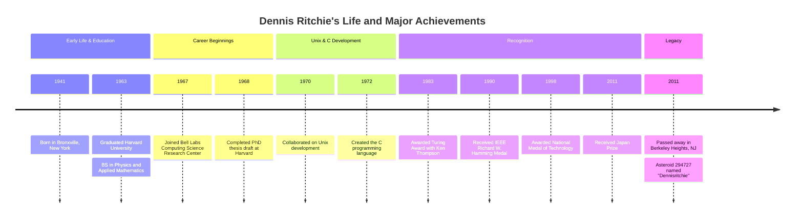

[W3Schools.com](https://www.w3schools.com/c/c_data_types.php)

[W3Schools.com](https://www.w3schools.com/c/c_variables_format.php)

[Dennis Ritchie](https://en.wikipedia.org/wiki/Dennis_Ritchie)

[Help cleaning up working but clunky code? | Codecademy](https://www.codecademy.com/forum_questions/5269ef6480ff337a5200081c)

<aside> 📢

Understanding the context of the creation of one of the most meaningful function of C history help us to understand why this function is important but also understand the needs and challenges people in history needed to overcome in order to respond to a wish. Nowadays, this functions has helped us repair countless bug but also increase the number of C user progaming. So let’s jump right in and understand why this function more than being a life saver, it is also essentiel part of programmer life in XXI century

</aside>

# # Overview

Let’s imagine we’re in the early 70s, a time when computers were the size of entire rooms


and programming was like talking to a stubborn old librarian—you had to be very specific, and even then, you weren’t sure yuou’d get the right answer. This was the world where `printf` was born.

Before printf, programmers had to use `clunky` , manual methods to display text on the screen. It was like trying to send a letter without envelopes—every message had to be written from scratch, formatted manually, and sent out with no guarantee it would look right. Then **Dennis Ritchie** and his lengendary work on the C programming language at Bell Labs. He needed a way for programmers to communicate with their programs clearly and consisely.

—> So he created `printf`



---

# The magic of `printf` : a Universal Translator

To understand why `printf` was a game-changer, let’s use an analogy.

Imagine you’re **chef** preparing a meal for hundreds of people. Each dish requires different ingredients and a unique presentation—one person wants soup, another a steak, and someone else a salad. Instead of writing down separate instructions for every dish, you can create a **recipe template.**

> Serve a [dish] with [side] you fille the blank as needed: “Serve a **steak** with **mashed potatoes**” or “Serve a **pasta** with **garlic**”

This is exactly what printf does for text output. Instead of writing a new function every time to print different types of values (integers, floating-point numbers, characters, etc.) we have a format string:

```c
printf("the result is %d:", number);
```

Here, `%d` is like a placeholder on a recipe car, ready to be filled with the correct ingredient (`number`). It allowed programmers to write one function that could adapt to many situations—a revolution in efficiency

---

# A bug fixer and Time saver

Before `printf` , debugging was like trying to fix a car engine in the dark. Programmers had to guess where things went wrong, sometimes writing custom output functions just to check what was happening inside their code. With `printf` , the could simply insert a line like:

`printf(”Value of x : %d\\n”, x);`

Suddenly, the darkness was gone— `printf` acted like a flashlight, showing them what was happening at each step.

Over the years, this simple function became the first tool every C programmer learns. It’s not just a function — it’s a lifesaver. Even today, if you ask a programmer to debug a tricky issue, odds are their first instinct will be to throw in a `printf` statement to see what’s going on. 😃

---

## The legacy of `printf` in the XXI century

Even though modern language have evolved over the time, `printf` still holds a special place in programming. It’s like the first **bycicle** you learned to ride—it might not be as fancy as modern bikes with all the gears and suspensions, but it taught you **the fundamentals.**

So next time you type `printf("Hello, world!\\n")` , remember you’re using a piece of programming history— a function that helped shape the way we communicate with computers.

---

### PRINTF is also called a SAK in programming

Just like a Swiss Army Knife, which has multiple tools (knife, scissors, screwdriver, bottle opener) in a single compact devices, a SAK describes a function that is highly versatile and can handle many different tasks using a **single** interface.

- it can format and print text.
- it can display numbers in different ways (decimals, hexadecimal, scientific notation, etc.)
- it can handle multiple data types at once
- it can be used for debugging, logging, and user communications

<aside> ⚙

This level of flexibility makes `printf` one of the most powerful and widely used functions in C. Many other languages have their own versions inspired by it, showing just how influential it is.

</aside>