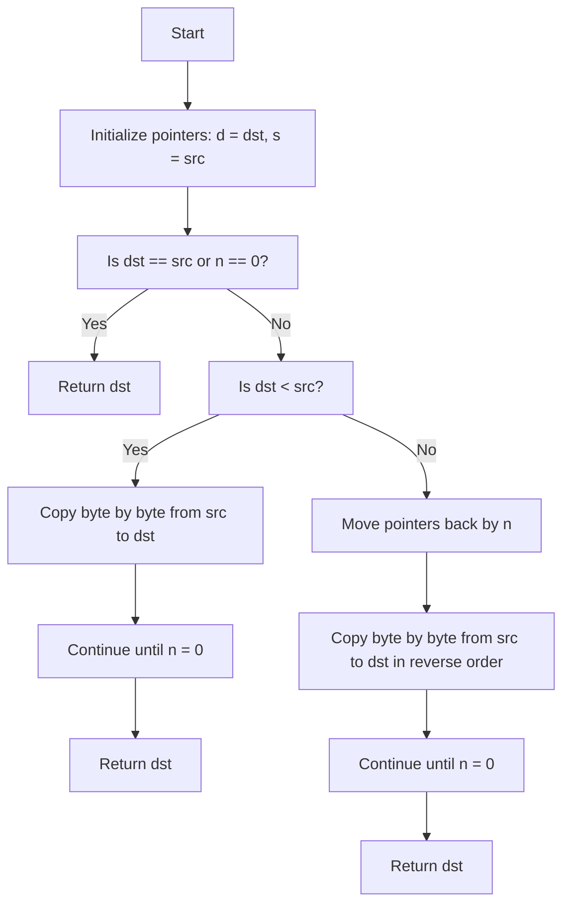

The function `ft_memmove` is a memory manipulation function that copies `n` bytes from a source memory region (`src`) to a destination memory region (`dst`). Unlike `memcpy`, `ft_memmove` safely handles overlapping memory regions, ensuring that data is copied correctly even if the memory regions overlap.

### Detailed Explanation:

The function signature is:

```c
void *ft_memmove(void *dst, const void *src, t_size n)

```

- **`dst`**: A pointer to the destination memory where data will be copied.
- **`src`**: A pointer to the source memory from which data will be copied.
- **`n`**: The number of bytes to copy.

The function returns a pointer to the destination (`dst`), which is a typical behavior for memory manipulation functions in C, enabling function chaining.

### Step-by-Step Breakdown:

1. **Typecasting `dst` and `src`**:
    
    - The function starts by casting the `dst` and `src` pointers to `unsigned char *` (i.e., byte pointers). This is done because memory is byte-oriented, so it needs to be manipulated at the byte level.
    
    ```c
    unsigned char *d = (unsigned char *)dst;
    const unsigned char *s = (const unsigned char *)src;
    
    ```
    
2. **Check for `dst == src` or `n == 0`**:
    
    - If `dst` and `src` are the same (i.e., the source and destination memory regions are the same) or if `n == 0` (i.e., there's nothing to copy), the function simply returns the destination pointer `dst`. This prevents unnecessary operations.
    
    ```c
    if (d == s || n == 0)
        return (dst);
    
    ```
    
3. **If `dst` is less than `src` (non-overlapping regions, `dst` is before `src`)**:
    
    - This block handles the case when the memory regions do not overlap or when `dst` is at a lower address than `src`. In this case, it is safe to copy the memory from the beginning of the source to the beginning of the destination.
    - The function loops through the source memory and copies each byte to the destination.
    
    ```c
    if (d < s) {
        while (n--) {
            *d++ = *s++;  // Copy each byte from src to dst
        }
    }
    
    ```
    
4. **If `dst` is greater than `src` (overlapping regions, `dst` is after `src`)**:
    
    - This block handles the case when the memory regions overlap, and the destination starts at a higher address than the source. If we copy from the beginning of the source to the destination, we would overwrite parts of the source before they are copied.
    - To prevent this, the function starts copying from the **end** of the memory regions. It first advances both the `dst` and `src` pointers by `n` bytes, and then it copies the memory in reverse order. This ensures that the data is copied correctly, even if the regions overlap.
    
    ```c
    else {
        d += n;  // Move dst pointer to the end
        s += n;  // Move src pointer to the end
        while (n--) {
            *--d = *--s;  // Copy each byte from src to dst in reverse order
        }
    }
    
    ```
    
5. **Return the destination pointer**:
    
    - Once the copying is complete, the function returns the destination pointer `dst`.
    
    ```c
    return (dst);
    
    ```
    

### Example Usage:

Here's an example to illustrate how `ft_memmove` works:

```c
#include <stdio.h>

int main() {
    char src[] = "Hello, World!";
    char dst[20];

    ft_memmove(dst, src, 13);  // Copy "Hello, World!" into dst

    printf("Source: %s\\n", src);  // "Hello, World!"
    printf("Destination: %s\\n", dst);  // "Hello, World!"

    return 0;
}

```

### How It Works:

- In the example above, `src` contains the string `"Hello, World!"`, and `dst` is an empty character array.
- The `ft_memmove` function copies 13 bytes from `src` to `dst`.
- Since `dst` and `src` do not overlap in this case, the function simply copies the bytes from `src` to `dst` one by one.

In case of overlapping memory, if the destination region is after the source, the function will copy the memory in reverse order to avoid data corruption.

### Time Complexity:

The time complexity of this function is **O(n)**, where `n` is the number of bytes to copy, because it needs to process each byte in the memory region.

### Conclusion:

- `ft_memmove` ensures safe memory copying, even when the source and destination memory regions overlap. This is a key difference from `memcpy`, which assumes the regions do not overlap.
- By copying from the start or from the end of the memory region based on the positions of `dst` and `src`, it prevents overwriting data during the copy operation.



### Explanation of the diagram:

1. **Start**: The function begins.
2. **Initialize pointers**: It initializes `d` to `dst` and `s` to `src` after casting to `unsigned char*` for byte-wise manipulation.
3. **Check if `dst` == `src` or `n == 0`**:
    - If `dst` and `src` are the same or if `n == 0`, it just returns `dst`, as no copying is needed.
4. **Check if `dst < src`**:
    - If `dst` is located before `src` in memory, it copies bytes from `src` to `dst` in a forward direction.
5. **Forward copy**:
    - The copying happens byte-by-byte using a loop (`d++ = *s++`), decrementing `n` until all bytes are copied.
6. **If `dst > src`**:
    - If `dst` is located after `src` in memory, the function moves the pointers to the end of the memory block.
7. **Reverse copy**:
    - The copying happens byte-by-byte from the end of the memory blocks towards the beginning (`--d = *--s`), ensuring that overwriting doesn't occur.
8. **Return**:
    - The function returns the `dst` pointer after completing the memory copy.