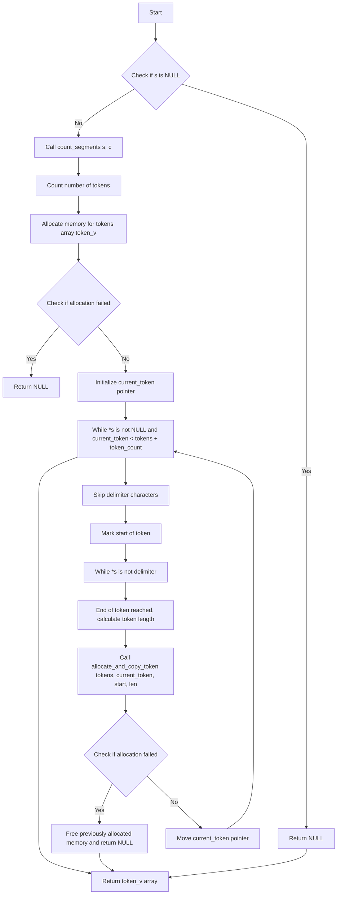

The code you've provided implements a function `ft_split`, which splits a given string into an array of substrings, divided by a specified delimiter (in this case, a character `c`). The function performs memory management carefully to avoid memory leaks, handling each step of allocation, copying, and deallocation if an error occurs.

Let's break down the flow of this code in detail.

### **Key Functions**

1. **`ft_split`** - Main function to split the string.
2. **`count_segments`** - Counts the number of segments in the string separated by the delimiter.
3. **`allocate_and_copy_tokens`** - Allocates memory for tokens (substrings) and copies the characters into them.
4. **`allocate_and_copy_token`** - Allocates memory for a single token and copies the substring into it.
5. **`safe_malloc`** - Safely allocates memory, handling errors by cleaning up any previously allocated memory if allocation fails.

---

### **Step-by-Step Breakdown**

---

### **1. `ft_split`**

This is the main function that returns a dynamically allocated array of strings (tokens), split by the delimiter.

### **Flow:**

- **Input:** `const char *s` (the string to split), `char c` (delimiter).
- **Output:** An array of strings (tokens), each containing a substring between delimiters.

### **Key Operations:**

1. **Count the number of tokens (`count_segments`)**:
    - The function first counts how many tokens the string will have based on the delimiter.
2. **Allocate memory for the array of tokens**:
    - It allocates memory for an array of strings, where each string will hold a token.
3. **Call `allocate_and_copy_tokens`**:
    - It then calls a helper function to allocate memory for each token and copy the substrings into the allocated memory.
4. **Return the result**:
    - If any of the allocations fail, it frees the memory and returns `NULL`. Otherwise, it returns the array of tokens.

---

### **2. `count_segments`**

This function counts how many substrings (tokens) exist in the string, separated by the delimiter.

### **Flow:**

- **Input:** `const char *str` (the string to process), `char delimiter` (the delimiter character).
- **Output:** The number of tokens (substrings).

### **Key Operations:**

1. Traverse the string while counting segments (substrings).
2. A segment begins when a non-delimiter character is encountered after a delimiter or at the start of the string.
3. Count each new segment, and return the count when the end of the string is reached.

---

### **3. `allocate_and_copy_tokens`**

This function is responsible for allocating memory for each token and copying the substrings into the allocated memory.

### **Flow:**

- **Input:** `char **tokens` (array of tokens), `const char *s` (input string), `char delimiter` (delimiter), `t_size token_count` (the number of tokens).
- **Output:** `0` for success, `1` for failure (if memory allocation fails).

### **Key Operations:**

1. **Traverse the string**:
    - The function traverses the string character by character, skipping over delimiters.
2. **For each token**:
    - It identifies the start and end of a token by finding the substring between two delimiters or the string boundaries.
    - It calls `allocate_and_copy_token` to allocate memory for the token and copy the substring into it.
3. **Return result**:
    - If any token fails to be allocated, it returns `1`, signaling failure.

---

### **4. `allocate_and_copy_token`**

This function is used to allocate memory for a single token and copy the corresponding substring from the original string into it.

### **Flow:**

- **Input:** `char **tokens` (array of tokens), `char **current_token` (current token pointer), `const char *start` (start of the token), `t_size len` (length of the token).
- **Output:** `0` for success, `1` for failure.

### **Key Operations:**

1. **Allocate memory**:
    - It calls `safe_malloc` to allocate memory for the token.
2. **Copy the token**:
    - It copies the substring into the newly allocated space.
3. **Return result**:
    - If memory allocation fails, it returns `1`, signaling failure.

---

### **5. `safe_malloc`**

This function performs memory allocation and ensures that in case of failure, previously allocated memory is freed, preventing memory leaks.

### **Flow:**

- **Input:** `char **token_v` (array of token pointers), `t_size pos` (current token position), `t_size buffer` (amount of memory to allocate).
- **Output:** `0` for success, `1` for failure.

### **Key Operations:**

1. **Allocate memory**:
    - It tries to allocate memory for a specific token.
2. **Handle failure**:
    - If memory allocation fails, it frees any previously allocated memory and returns `1`.
3. **Return result**:
    - If the allocation is successful, it returns `0`.

---

### **Diagram of the `ft_split` Process**

1. **Initial Input:**
    - A string `s = "apple,banana,grape"` and delimiter `,`.
2. **`ft_split` Calls `count_segments`:**
    - It counts the number of segments (3: "apple", "banana", "grape").
3. **Memory Allocation:**
    - It allocates an array of pointers for 3 tokens.
4. **Calling `allocate_and_copy_tokens`:**
    - For each token:
        1. It finds the substring between delimiters (e.g., "apple").
        2. It allocates memory for the token and copies the substring.
        3. It stores the pointer to the token in the array.
5. **Result:**
    - Returns an array of tokens: `["apple", "banana", "grape"]`.

---

### **Example Walkthrough:**

### Input:

```c
ft_split("apple,banana,grape", ',');

```

1. **Step 1: Count Segments**
    - `count_segments` counts `3` tokens: "apple", "banana", "grape".
2. **Step 2: Allocate Memory**
    - `token_v` is allocated with enough space for 3 pointers (`["apple", "banana", "grape", NULL]`).
3. **Step 3: Process Tokens**
    - **First Token: "apple"**:
        - `safe_malloc` allocates memory for the first token.
        - `allocate_and_copy_token` copies the substring "apple".
    - **Second Token: "banana"**:
        - `safe_malloc` allocates memory for the second token.
        - `allocate_and_copy_token` copies the substring "banana".
    - **Third Token: "grape"**:
        - `safe_malloc` allocates memory for the third token.
        - `allocate_and_copy_token` copies the substring "grape".
4. **Final Output:**
    - The function returns the array of tokens: `["apple", "banana", "grape"]`.

---

### **Edge Cases:**

1. **Empty String**:
    
    ```c
    ft_split("", ',');
    // Returns NULL (no tokens).
    
    ```
    
2. **Delimiter Not Present**:
    
    ```c
    ft_split("apple", ',');
    // Returns ["apple"].
    
    ```
    
3. **String with Only Delimiters**:
    
    ```c
    ft_split(",,,,", ',');
    // Returns NULL (no valid tokens).
    
    ```
    
4. **Multiple Consecutive Delimiters**:
    
    ```c
    ft_split("apple,,banana", ',');
    // Returns ["apple", "banana"].
    
    ```
    

---

### **Conclusion:**

- The function `ft_split` effectively splits a string into multiple substrings using a given delimiter.
- It manages memory carefully to avoid leaks by freeing previously allocated memory if any allocation fails.
- The helper functions `count_segments`, `allocate_and_copy_tokens`, and `allocate_and_copy_token` work together to handle the allocation and copying of substrings.



### **Explanation of the Flow:**

1. **Start:**
    - The flow begins.
2. **Check if `s` is NULL:**
    - If the string `s` is NULL, return `NULL` (as no splitting can be done).
3. **Count Segments:**
    - The function `count_segments` is called to calculate how many tokens there are in the string based on the delimiter.
4. **Memory Allocation:**
    - The function attempts to allocate memory for an array of pointers to tokens.
    - If allocation fails, return `NULL`.
5. **Main Loop to Process Tokens:**
    - The main loop processes each token by:
        - Skipping delimiters.
        - Identifying the start of a token.
        - Finding the end of the token.
        - Allocating memory and copying the token into the array of tokens.
6. **Check Allocation for Each Token:**
    - After allocating memory for each token, the function checks if the allocation failed. If it did, it frees the previously allocated memory and returns `NULL`.
7. **Final Step:**
    - Once all tokens have been processed, the function returns the array of tokens.